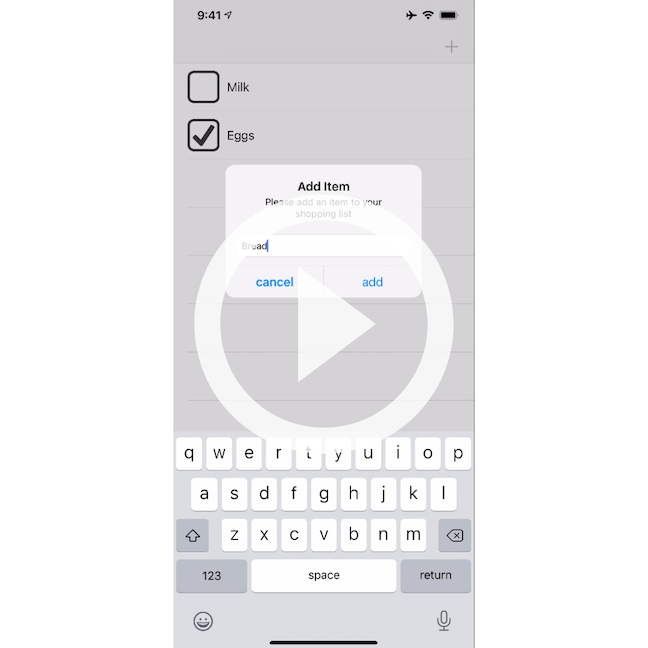

# iOS Skills Assessment 2

This assessment includes a series of multiple choice questions as well
as a section to practice coding skills.

## 📚 Covered Concepts

This assessment evaluates your ability to create applications using
`UITableViews` and the `Protocol-Delegate communication pattern` to
display and manipulate a collection of data. It covers the following
concepts taught in Week 2:

- The MVC design pattern
- The role and use of model controllers
- The role and use of a singleton/shared instance
- JSON Persistence
- The role and use of the Protocol-Delegate communication pattern
- The use of alert controllers

**Note:** You may not copy and paste code from previous projects.

You will have 5 hours to complete Part 1 and 2 of this assessment.

## ❗ Getting Started

Need help getting started? The instructions below will walk
you through how to clone an assessment repository from GitHub
and submit your work.

[🔗 How to do Skills Assessments from Github Classroom](https://fellowship.hackbrightacademy.com/materials/homework/how-to-skills-github/)

## 📝 Assessment Instructions (2 parts)

### Part 1 -- Multiple Choice

1. Is Protocol-Delegate considered to be an architectural pattern?

   - [ ]  Yes
   - [ ]  No

2. You can unwrap optional properties using (select all that apply):

   - [ ]  `guard let`
   - [ ]  `private func`
   - [ ]  `if let`
   - [ ]  `nil-coalescing`

3. When navigating backwards from a detail view to a table view,
   the table view's `viewDidLoad` function will run again.

   - [ ] True
   - [ ] False

4. The Notification-Listener communication pattern is a:

   - [ ]  One to Many communication pattern
   - [ ]  One to One communication pattern
   - [ ]  One to Zero communication pattern
   - [ ]  Zero to One communication pattern

5. `UIAlertActions` have 3 styles:

   - [ ]  Cancel, Apply, Default
   - [ ]  Cancel, Apply, Destructive
   - [ ]  Cancel, Default, Destructive
   - [ ]  `UIAlertActions` do not have 3 styles

6. The Equatable Protocol allows you to:

    - [ ]  Save objects into JSON Data
    - [ ]  Compare two objects
    - [ ]  Delete tableView rows

7. A segue requires an identifier.

   - [ ]  True
   - [ ]  False

8. A custom cell is an example of a:

   - [ ]  View
   - [ ]  Model
   - [ ]  Model Controller
   - [ ]  View Controller

9. A class can simultaneously be a delegate for multiple protocols.

    - [ ]  True
    - [ ]  False

10. A reuse identifier is necessary for both a table view controller,
    and a collection view controller.

    - [ ]  True
    - [ ]  False

### Part 2 -- Shopping List App

Watch the link to the screen recording below before you code. It
demonstrates the application you'll create for this assessment.

For Part 2 of the assessment, you will build a shopping list application.
The shopping list should allow you to create shopping list items and check
them off if purchased.

Note the following requirements:

- The initial screen shows a list of shopping items. Each row shows the item
  title and a checkbox (checked if purchased, unchecked if not).
- There will be an add button that will allow the user to add an item
  to the shopping list. This can be done by using a text field on the table
  view controller. Alternatively, it can be done with an alert controller (extra
  credit).
- Tapping on a checkbox will toggle the items purchased state.
- Quitting the app and re-launching it will show your shopping items and their
  purchased state (persistence).
- Feel free to use any extra time to challenge yourself with the extra credit
  section and to make your app look good.

### Extra Credit

- Use an alert controller to prompt the user for a shopping item.
- Implement sectioning to show purchased and non-purchased items in separate
  sections.
- Add a detail view which allows the quantity of an item to be changed, as
  well as an item's purchased state.
